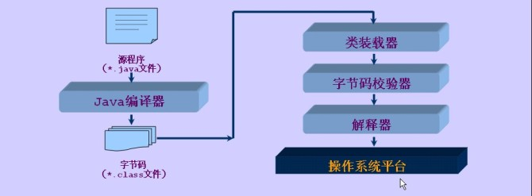
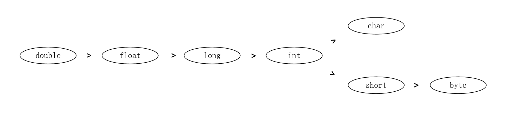
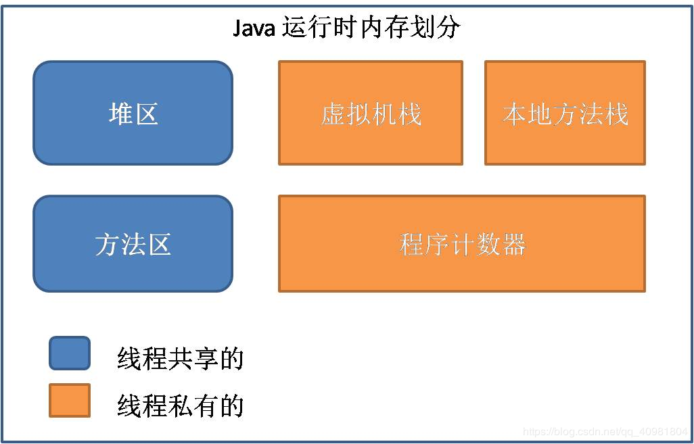
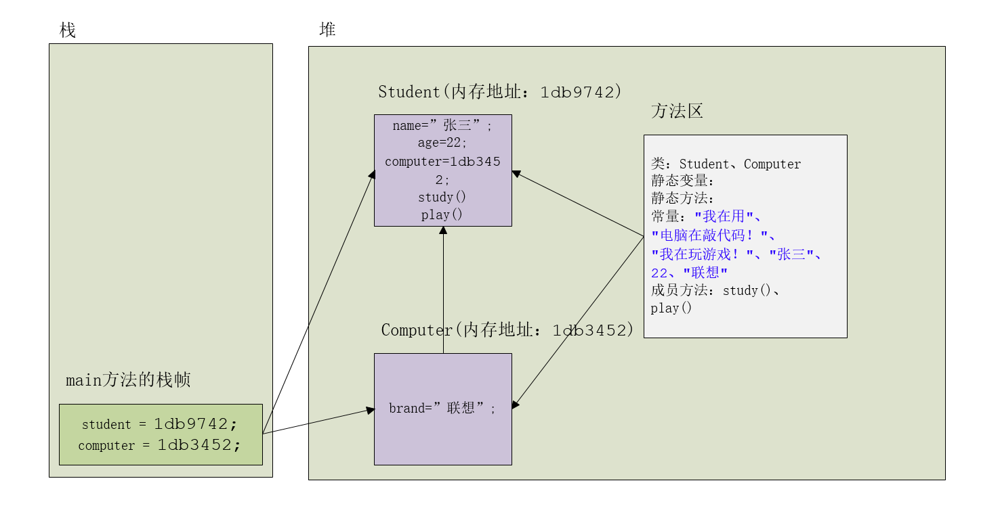
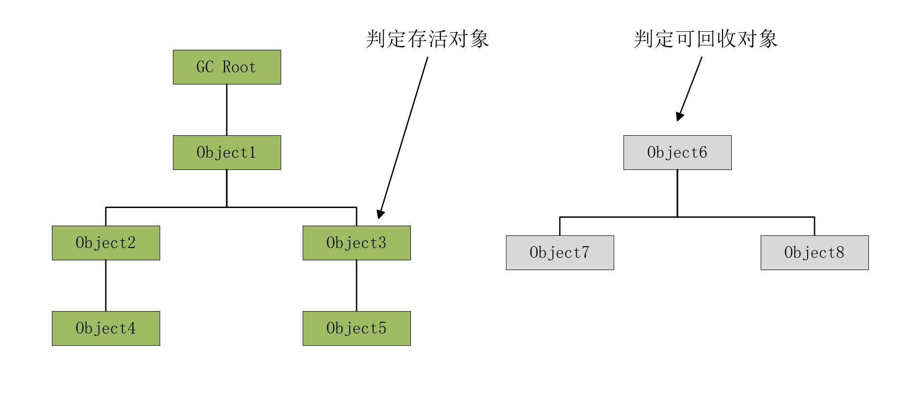
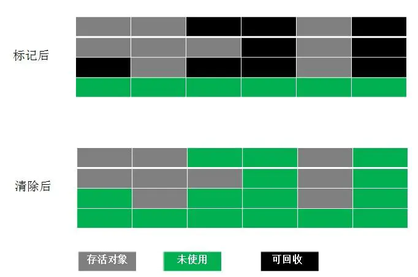
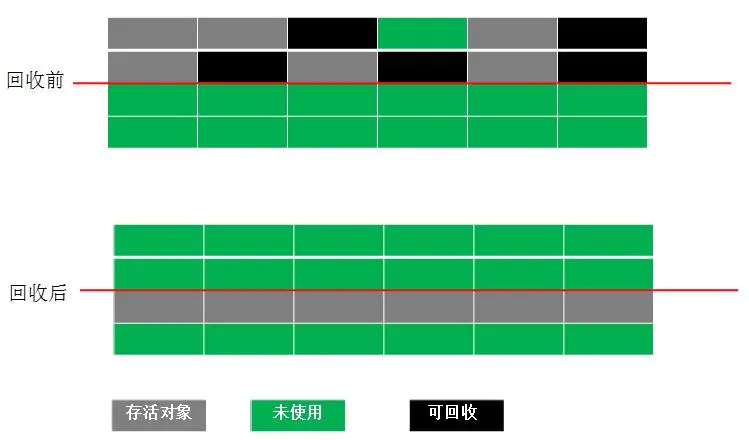
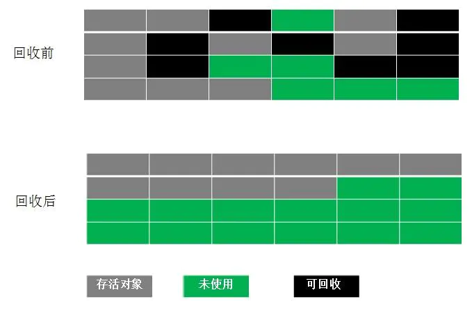
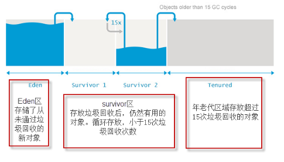

Java基础复习一

<!--more-->

---

> **Java基础复习**
>
> * [Java基础复习一](https://crazy-sky.github.io/2020/09/21/Java基础复习一/)
> * [Java基础复习二](https://crazy-sky.github.io/2020/09/23/Java基础复习二/)

# 1、Java是编译型的还是解释型的

**定义：** 
编译型语言：把做好的源程序全部编译成二进制代码的可运行程序。然后，可直接运行这个程序。 
解释型语言：把做好的源程序翻译一句，然后执行一句，直至结束！ 

**区别：**
编译型语言，执行速度快、效率高；依靠编译器、跨平台性差些。 
解释型语言，执行速度慢、效率低；依靠解释器、跨平台性好。 

**个人认为**，java是解释型的语言，因为虽然java也需要编译，编译成.class文件，但是并不是机器可以识别的语言，而是字节码，最终还是需要 jvm的解释，才能在各个平台执行，这同时也是java跨平台的原因。所以可是说java即是编译型的，也是解释型，但是假如非要归类的话，从概念上的定义，恐怕java应该归到解释型的语言中。 

**附：**
编译型的语言包括：C、C++、Delphi、Pascal、Fortran 
解释型的语言包括：Java、Basic、javascript




# 2、JDK、JRE、JVM三者间的关系

**JDK（Java Development Kit）**即Java开发工具包，是面向开发者的，是整个Java的核心，包括了Java运行环境JRE、Java工具和Java基础类库。

> JDK四个主要的文件夹：
> * bin：最主要的是编译器(javac.exe)
> * include：Java和JVM交互用的头文件
> * lib：类库
> * jre：Java运行环境

**JRE（Java Runtime Environment）**即Java运行时环境，是面向使用者的，是运行JAVA程序所必须的环境的集合，包含JVM标准实现及Java核心类库。

**JVM（Java Virtual Machine）**即Java虚拟机，是整个java实现跨平台的最核心的部分，能够运行以Java语言写作的软件程序。

**三者联系：**

JVM不能单独搞定class的执行，解释class的时候JVM需要调用解释所需要的类库lib。在JDK下面的的jre目录里面有两个文件夹bin和lib,在这里可以认为bin里的就是jvm，lib中则是jvm工作所需要的类库，而jvm和 lib和起来就称为jre。JVM+Lib=JRE。总体来说就是，我们利用JDK（调用JAVA API）开发了属于我们自己的JAVA程序后，通过JDK中的编译程序（javac）将我们的文本java文件编译成JAVA字节码，在JRE上运行这些JAVA字节码，JVM解析这些字节码，映射到CPU指令集或OS的系统调用。

**注：**

JDK为开发提供支持负责源代码文件（.java）编译，JRE为运行提供支持负责提供公共类库与字节码文件（.class）解释，JVM为JRE提供支持负责字节码文件（.class）的具体解释与运行。


# 3、常用的DOS命令

> dir ：列出当前目录下的文件以及文件夹
> md ：创建目录
> rd ：删除目录
> cd ：进入指定目录
> cd.. ：退回到上一级目录
> cd\ ：退回到根目录
> del ：删除文件
> exit ：退出dos命令行
> cls：清理屏幕命令
> Tab键：自动补全
> 上下键：查找敲过的命令


# 4、标识符命名规则

标识符只能以字符、下划线、美元符号$开头，其他部分只能由字符、下划线、美元符号$和数字组成，如"name"、"$name"、"_name$11"。

Java采用的是Unicode编码，所以字符包括中文，标识符可这样命名，如"姓名12"、"_姓名$89"

**注：**不建议使用中文

**驼峰命名法:**

变量名、方法名第一个单词首字母小写，其他单词首字母大写，如："userName"、"selectByPrimaryKey()"。

类名每个单词的首字母大写，如："UserLogin"、"Admin"。


# 5、基本数据类型

| 序号 | 数据类型        | 位数 | 默认值   | 取值范围                         | 举例说明          |
| :--- | :-------------- | :--- | :------- | :------------------------------- | :---------------- |
| 1    | byte(位)        | 8    | 0        | -2^7 - 2^7-1（-128 - 127）       | byte b = 10;      |
| 2    | short(短整数)   | 16   | 0        | -2^15 - 2^15-1（-32768 - 32767） | short s = 10;     |
| 3    | int(整数)       | 32   | 0        | -2^31 - 2^31-1（约21亿）         | int i = 10;       |
| 4    | long(长整数)    | 64   | 0L       | -2^63 - 2^63-1                   | long l = 10L;     |
| 5    | float(单精度)   | 32   | 0.0F     | -2^31 - 2^31-1                   | float f = 10.0F;  |
| 6    | double(双精度)  | 64   | 0.0      | -2^63 - 2^63-1                   | double d = 10.0;  |
| 7    | char(字符)      | 16   | '\u0000' | 0 - 2^16-1                       | char c = 'c';     |
| 8    | boolean(布尔值) | 8    | false    | true、false                      | boolean b = true; |

在进行整形的算术运算时，有long类型会自动转换成long类型，没有long类型会转换成int类型

```java
short a = 1;
byte b = 2;
short c = a + b; // 报错"Type mismatch: cannot convert from int to short"
int d = a + b; // 无错

long e = 1L;
int f = a + e; // 报错"Type mismatch: cannot convert from long to int"
long g = a + e; // 无错
```

小容量类型会转换成大容量类型，容量并非指字节大小

```java
// float：4个字节    long：8个字节
float a = 3.14F;
long b = 100L;

long c = a; // 报错"Type mismatch: cannot convert from float to long"
float d = b; // 无错
```

数据类型按容量大小排序为:



浮点数进行运算时会出现精度问题

```java
double a = 0.2;
double b = 0.1;
double c = a + b;
double d = a * b;
System.out.println(c); // 输出为："0.30000000000000004",正确结果应为"0.3"
System.out.println(d); // 输出为："0.020000000000000004",正确结果应为"0.02"

// 使用BigDecimal可解决精度问题
BigDecimal e = BigDecimal.valueOf(a);
BigDecimal f = BigDecimal.valueOf(b);
BigDecimal g = e.add(f);
BigDecimal h = e.multiply(f);
System.out.println(g); // 输出为："0.3",正确结果应为"0.3"
System.out.println(h); // 输出为："0.02",正确结果应为"0.02"
```


# 6、运算符

位运算符 ~（取反） ：

运算规则：如果位为0，结果是1，如果位为1，结果是0.

比如：~37

在Java中，所有数据的表示方法都是以补码的形式表示，如果没有特殊说明，Java中的数据类型默认是int,int数据类型的长度是8位，一位是四个字节，就是32字节，32bit.

8转为二进制是100101

补码后为： 00000000 00000000 00000000 00100101

取反为：    11111111 11111111 11111111 11011010

因为高位是1，所以原码为负数，负数的补码是其绝对值的原码取反，末尾再加1。

因此，我们可将这个二进制数的补码进行还原： 首先，末尾减1得反码：11111111 11111111 11111111 11011001 其次，将各位取反得原码：

00000000 00000000 00000000 00100110，此时二进制转原码为38


# 7、Java switch 语句表达式支持的数据类型

* 在Java5以前，表达式只能是byte，short，char，int类型
   byte、short、char类型可以在不损失精度的情况下向上转型成int类型。
* 从Java5开始，java中引入了枚举类型（enum类型）和byte，short，char，int的包装类
   四个包装类的支持是因为java编译器在底层进行了拆箱操作；
   枚举类型的支持是因为枚举类有一个ordinal方法,该方法实际上是返回一个int类型的数值。
* 从Java7开始，exper还可以是String类型
   String类中因为有一个hashCode方法,结果也是返回int类型。

**总结：**
> 到Java8为止，可以认为switch语句表达式支持byte、short、char、int、enum、Byte、Short、Character、Integer 、String共十种数据类型。底层实现目前只支持整型（int）数据。

**注意：**

>* ***switch中可以不能有null。***在switch语句中，表达式的值不能是null，否则会在运行时抛出NullPointerException。在case子句中也不能使用null，否则会出现编译错误。
>* ***case语句不能重复。***case字句的值是不能重复的。对于字符串类型的也一样，但是字符串中可以包含Unicode转义字符。重复值的检查是在Java编译器对Java源代码进行相关的词法转换之后才进行的。也就是说，有些case字句的值虽然在源代码中看起来是不同的，但是经词法转换之后是一样的，就会在成编译错误。比如：“男”和“\u7537”就是一个意思。
>* ***什么情况下要使用枚举而不是用String类型。***在Java 7之前switch中使用String类型的时候只能用枚举类型。而在Java 7 中由于switch语句增加了对字符串类型的支持，很多人就选择直接使用String类型。但是这样有个缺点，就是可读性差、维护麻烦。假如switch语句在多个地方出现的时候，在程序中多次出现字符串常量是一个不好的现象，而用枚举就可以避免这种情况。因此如果代码中多个地方使用swich语句来判断字符串，就考虑用枚举类型进行替换。


# 8、Java带标签的break 和带标签的continue以及goto

***labe：*** 就是标签  要终止的位置 

***break label ：***终止结束标签处的语句（switch也有效）

***continue label：*** 终止本次循环 跳到标签位置进行接下来的循环

***goto：***在Java中作为保留字，并没有实现它。Java中支持的break和continue虽然能实现goto语句的功能但做了一定的限制。

**示例：**

```java
// 假设要在九九乘法表的基础上加上一些限制条件，然后输出被限制后的九九乘法表
// 限制条件为只输出奇数行的九九乘法表，当遇到相乘等于49时结束
public static void main(String[] args) {
    
    /*
     * "lable:" 即为标签用于标识位置，标签可以像注解里这样写分两行标识for循环位置，也可以想代码中那样写一行标识for循环位置，效果是一样的。
     * lable:
     * for (int i = 1; i <= 9; i++) { // 第一层循环
     */
    
    lable:for (int i = 1; i <= 9; i++) { // 第一层循环
        for (int j = 1; j <= i; j++) { // 第二层循环
            if (i % 2 == 0) { // 当遇到奇数行时，跳过这一行的输出，使用break;直接结束第二层循环，可达到同样效果，这里使用的带标签的continue作用终止本次循环跳到标签位置进行该标签位置循环（即第一层循环）接下来的循环
                continue lable;
            }
            if (i * j == 49) { // 当遇到相乘等于49时结束，结束所有循环，使用普通break;只能结束当前循环（即第二层循环，无法结束第一层循环），而使用带标签的break可以结束标签位置的循环（即可直接结束第一层循环）
                break lable;
            }
            System.out.print(i + "*" + j + "=" + i * j + "\t");
        }
        System.out.println();
    }
}
```

**执行结果：**

```java
1*1=1    
3*1=3    3*2=6    3*3=9    
5*1=5    5*2=10    5*3=15    5*4=20    5*5=25    
7*1=7    7*2=14    7*3=21    7*4=28    7*5=35    7*6=42    
```


# 9、Java 堆、栈、方法区的理解

**堆：** ***类的对象放在heap（堆）中***，所有的类对象都是通过new方法创建，创建后，在stack（栈）会创建类对象的引用（内存地址）。

> * 堆用于存储创建好的对象和数组(数组也是对象)
> * JVM只有一个堆，被所有线程共享
> * 堆是一个不连续的内存空间，分配灵活，速度慢!

**栈：**Java栈的区域很小，只有1M，特点是存取速度很快，所以在stack中存放的都是快速执行的任务，基本数据类型的数据，和对象的引用（reference）。

> * 栈描述的是方法执行的内存模型。每个方法被调用都会创建一个栈帧(存储局部变量、操作数、方法出口等)
> *  ***JVM为每个线程创建一个栈***，用于存放该线程执行方法的信息(实际参数、局部变量等)
> *  栈属于线程私有，不能实现线程间的共享!
> *  栈的存储特性是“先进后出，后进先出”
> *  栈是由系统自动分配，速度快!栈是一个连续的内存空间!

**方法区：**method（方法区）又叫静态区，存放所有的①类（class），②静态变量（static变量），③静态方法，④常量和⑤成员方法。

> *  JVM只有一个方法区，被所有线程共享!
> * 方法区实际也是堆，只是用于存储类、常量相关的信息!
> * 用来存放程序中永远是不变或唯一的内容。(类信息【Class对象】、静态变量、字符串常量等)



**示例：**

```java

// 学生类
class Student{
    
    String name;
    
    int age;
    
    Computer computer;
    
    void study() {
        System.out.println("我在用" + computer.brand + "电脑在敲代码！");
    }
    
    void play() {
        System.out.println("我在玩游戏！");
    }
}

// 计算机类
class Computer{
    
    String brand;
}

// 测试类
public class Test {
    
    // 当程序运行时，首先会运行main方法
    public static void main(String[] args) {
        // 当运行main方法，进入到main方法但没有执行具体语句时，下图中堆里的方法区中的内容已存在，栈中会出现main方法的栈帧
        
        // 当new Student、new Computer 后堆中将会存储student、computer对象，此时成员变量值为默认值
        // 当给成员变量赋值时，如赋值常量"张三"时，将会去方法区中取
        Student student = new Student();
        student.name = "张三";
        student.age = 22;
        
        Computer computer = new Computer();
        computer.brand = "联想";
        
        student.computer = computer;
    
        student.study();
        student.play();
        // 当程序执行到这里时内存区如下图所示，注意此时main方法未结束，栈中仍有main方法的栈帧
    }

}
```



> **参考资料：**
>
> [java 堆栈，方法区(永久代)的理解](https://www.cnblogs.com/augus007/articles/10185796.html)

# 10、Java 垃圾回收机制（Garbage Collection）

## 10.1、基本概念

**垃圾回收（Garbage Collection）：**是Java虚拟机（JVM）垃圾回收器提供的一种用于在空闲时间不定时回收无任何对象引用的对象所占据的内存空间的一种机制。

**引用：**如果Reference类型的数据中存储的数值代表的是另外一块内存的起始地址，就称这块内存代表着一个引用。

**引用又分为强引用、软引用、弱引用、虚引用四种：**

>* **强引用（Strong Reference）：**如“Object obj = new Object（）”，这类引用是java中最普遍的，只要强引用还存在，垃圾收集器就永远不会回收掉被引用的对象，不管内存是否够用。
>
>* **软引用（Soft Reference）：**它用来描述一种可能有用，但不是必须的对象，在系统内存不够用时，这类引用会在垃圾收集器下一次回收垃圾时被回收。
>
>* **弱引用（Weak Reference）：**它是用来描述非必须的对象，但它的强度比软引用更弱些，被弱引用关联的对象只能生存到下一次垃圾收集器回收垃圾之前，不论系统内存是否够用，都会回收掉只被弱引用关联的对象。
>
>* **虚引用（Phantom Reference）：**最弱的一种引用关系，完全不会对其生存时间构成影响，也无法通过虚引用来取得一个对象实例。为一个对象设置虚引用的唯一目的就是希望能在这个对象被收集器回收时收到一个系统通知。

## 10.2、垃圾回收算法

### 10.2.1、垃圾检测算法

#### 引用计数法

堆中每个对象都有一个引用计数。被引用一次，计数加1. 被引用变量值变为null，则计数减1，直到计数为0，则表示变成无用对象。优点是算法简单，缺点是“相互引用的无用对象”无法别识别。比如对象有一个对子对象的引用，子对象反过来引用父对象，它们的引用计数永远不可能为 `0`。因此，Java 里没有采用这样的方案来判定对象的“存活性”。

```java
public class Student {
    
    Student friend;
    
    public static void main(String[] args) {
        Student student1 = new Student();
        Student student2 = new Student();
        
        // 相互引用
        student1.friend = student2;
        student2.friend = student1;
        
        // 虽然将两个对象赋值为null，但两个对象仍然相互引用，导致它们的引用计数器都不为 0
        student1 = null;
        student2 = null;
    }
}
```


#### 引用可达法(根搜索算法)

程序把所有的引用关系看作一张图，从一个节点GC ROOT开始，寻找对应的引用节点，找到这个节点以后，继续寻找这个节点的引用节点，当所有的引用节点寻找完毕之后，剩余的节点则被认为是没有被引用到的节点，即无用的节点。



### 10.2.2、垃圾收集算法

#### 标记-清除（`Mark-Sweep`）算法

> ***标记-清除算法分为两个阶段：***
>
> * 标记阶段：标记出所有存活的对象。
> * 清除阶段：回收未被标记的可回收对象的内部空间。



> ***小结：***
>
> * 优点：算法实现较容易，不需要移动对象
> * 缺点：
>
>     * 算法过程需要暂停整个应用，效率不高。
>     * 标记清除后会产生大量不连续的内存碎片，碎片太多可能会导致后续过程中需要为大对象分配空间时无法找到足够的空间而提前触发新的一次垃圾收集动作。

#### 复制（`Copying`）算法

> 为了解决标志-清除算法的缺陷，由此有了复制算法。
> 复制算法将可用内存分为两块，每次只用其中一块，当这一块内存用完了，就将还存活着的对象复制到另外一块上面，然后再把已经使用过的内存空间一次性清理掉。



> ***小结：***
>
> - 优点：实现简单，不易产生内存碎片，每次只需要对半个区进行内存回收。
> - 缺点：内存空间缩减为原来的一半；算法的效率和存活对象的数目有关，存活对象越多，效率越低。

#### 标记-整理（`Mark-Compact`）算法

> 为了更充分利用内存空间，提出了标记-整理算法。
> 此算法结合了“标记-清除”和“复制”两个算法的优点。
> 该算法标记阶段和“标志-清除”算法一样，但是在完成标记之后，它不是直接清理可回收对象，而是将存活对象都向一端移动，然后清理掉端边界以外的内存。



#### 分代收集（`Generational Collection`）算法

> 分代垃圾回收机制，是基于这样一个事实：不同的对象的生命周期是不一样的。因此，不同生命周期的对象可以采取不同的回收算法，以便提高回收效率。我们将对象分为三种状态：年轻代、年老代、持久代。

**年轻代：**所有新生成的对象首先都是放在Eden区。 年轻代的目标就是尽可能快速的收集掉那些生命周期短的对象，对应的是Minor GC，每次 Minor GC 会清理年轻代的内存，算法采用效率较高的复制算法，频繁的操作，但是会浪费内存空间。当“年轻代”区域存放满对象后，就将对象存放到年老代区域。

**年老代：**在年轻代中经历了N(默认15)次垃圾回收后仍然存活的对象，就会被放到年老代中。因此，可以认为年老代中存放的都是一些生命周期较长的对象。年老代对象越来越多，我们就需要启动Major GC和Full GC(全量回收)，来一次大扫除，全面清理年轻代区域和年老代区域。

**持久代：**用于存放静态文件，如Java类、方法等。持久代对垃圾回收没有显著影响。



**Minor GC：**用于清理年轻代区域。Eden区满了就会触发一次Minor GC。清理无用对象，将有用对象复制到“Survivor1”、“Survivor2”区中(这两个区，大小空间也相同，同一时刻Survivor1和Survivor2只有一个在用，一个为空)

**Major GC：**用于清理老年代区域。

**Full GC：**用于清理年轻代、年老代区域。 成本较高，会对系统性能产生影响。

**垃圾回收过程：**

1. 新创建的对象，绝大多数都会存储在Eden中，

2. 当Eden满了（达到一定比例）不能创建新对象，则触发垃圾回收（GC），将无用对象清理掉，

?      然后剩余对象复制到某个Survivor中，如S1，同时清空Eden区

3. 当Eden区再次满了，会将S1中的不能清空的对象存到另外一个Survivor中，如S2，

?     同时将Eden区中的不能清空的对象，也复制到S1中，保证Eden和S1，均被清空。

4. 重复多次(默认15次)Survivor中没有被清理的对象，则会复制到老年代Old(Tenured)区中，
5. 当Old区满了，则会触发一个一次完整地垃圾回收（FullGC），之前新生代的垃圾回收称为（minorGC）

### 10.2.3、垃圾收集器（`GC`）

不同虚拟机所提供的垃圾收集器可能会有很大差别，下面的例子是 `HotSpot`。

新生代收集器使用的收集器：`Serial`、`PraNew`、`Parallel Scavenge`。
 老年代收集器使用的收集器：`Serial Old`、`Parallel Old`、`CMS`。


垃圾收集器图

1. `Serial` 收集器（复制算法)
    新生代单线程收集器，标记和清理都是单线程，优点是简单高效。
2. `Serial Old`收集器(标记-整理算法)
    老年代单线程收集器，`Serial` 收集器的老年代版本。
3. `ParNew` 收集器(停止-复制算法)  　
    新生代收集器，可以认为是 `Serial` 收集器的多线程版本，在多核 `CPU` 环境下有着比 `Serial` 更好的表现。
4. `Parallel Scavenge` 收集器(停止-复制算法)
    并行收集器，追求高吞吐量，高效利用 `CPU`。吞吐量一般为 `99%`， 吞吐量 `=` 用户线程时间 `/` (用户线程时间 `+` GC线程时间)。适合后台应用等对交互相应要求不高的场景。
5. `Parallel Old` 收集器(停止-复制算法)
    `Parallel Scavenge` 收集器的老年代版本，并行收集器，吞吐量优先。
6. `CMS(Concurrent Mark Sweep)` 收集器（标记-清理算法）
    高并发、低停顿，追求最短 `GC` 回收停顿时间，`cpu` 占用比较高，响应时间快，停顿时间短，多核 `cpu` 追求高响应时间的选择。

根据对象的生命周期的不同将内存划分为几块，然后根据各块的特点采用最适当的收集算法。大批对象死去、少量对象存活的（新生代），使用复制算法，复制成本低；对象存活率高、没有额外空间进行分配担保的（老年代），

> **参考资料：**
>
> [Java 垃圾回收机制整理](https://www.jianshu.com/p/b78ac4bf13ae)
>
> [通用的分代垃圾回收机制](https://www.sxt.cn/Java_jQuery_in_action/The_garbage_collection_mechanism.html)

# 11、参数传值机制

在Java中，所有的方法参数都是“值传递”，即传递的是值的副本。实参为“原件”，形参为“复印件”，改变形参不会改变实参。

**基本数据类型参数的传值**

传递的是值的副本。 副本改变不会影响原件。

**引用数据类型参数的传值**

传递的是值的副本。但是引用类型指的是“对象的地址”。因此，副本和原参数都指向了同一个“地址”，改变“副本指向地址对象的值，也意味着原参数指向对象的值也发生了改变”。不过，当改变的是副本，即改变的只是传过来的“对象的地址”时，仍满足副本改变不会影响原件。

**代码示例**

```java
public class Test {
    
    public static void main(String[] args) {
        
        Test test = new Test();
        
        // 基本数据类型参数的传值测试
        int x = 1;
        test.Test1(x);
        System.out.println("test1：" + x);
        
        // 引用类型参数的传值
        Person person1 = new Person("张三", 18);
        test.Test2(person1);
        System.out.println("test2：" + person1.name + " " + person1.age);
        
        Person person2 = new Person("张三", 18);
        test.Test3(person2);
        System.out.println("test3：" + person2.name + " " + person2.age);
    }
    
    // 基本数据类型参数的传值
    public void Test1(int x) {
        x = 3;
    }
    
    // 引用类型参数的传值，改变“副本”指向的对象的值
    public void Test2(Person person) {
        person.name = "李四";
        person.age = 19;
    }
    
    // 引用类型参数的传值，改变“副本”的值
    public void Test3(Person person) {
        person = new Person("王老五", 19);
    }
}

class Person {
    
    String name;
    int age;
    
    public Person(String name, int age) {
        this.name = name;
        this.age = age;
    }
}
```

**运行结果**

```java
test1：1
test2：李四 19
test3：张三 18
```

由上可知，当传递的是基本数据类型时，形参改变不会影响实参，即传递过来的“副本”不会影响“原件”（如方法test1）；当传递的是引用数据类型时，如果改变形参指向的对象时，实参指向的对象也会被改变，即改变“副本”指向的对象的值，“原件”也会被改变（如方法test2），如果只改变形参不会影响实参，即只改变“副本”不会影响“原件”（如方法test3）。

---

**学习所得，资料、图片部分来源于网络，如有侵权，请联系本人删除。**

**才疏学浅，若有错误或不当之处，可批评指正，还请见谅！**

