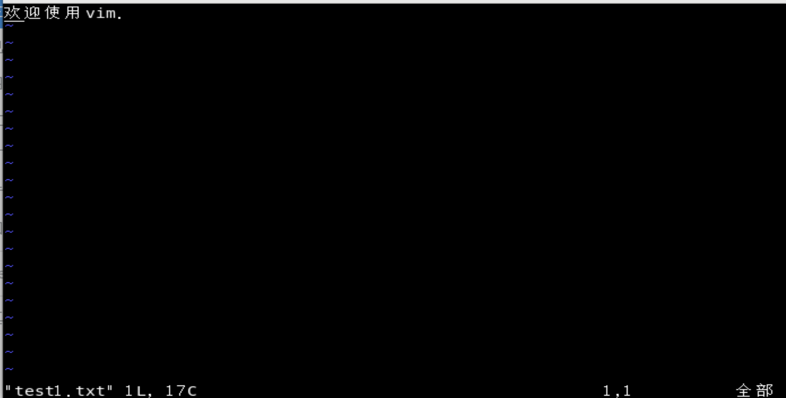
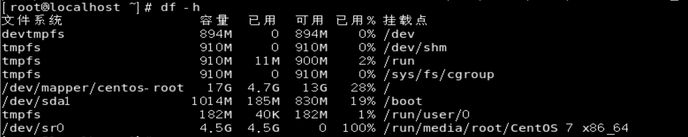

Linux基础

<!--more-->

---

# 1、linux简介

> Linux 是一种自由和开放源码的类 UNIX 操作系统。
> Linux 英文解释为 **Linux is not Unix**。
> Linux 是在 1991 由林纳斯·托瓦兹在赫尔辛基大学上学时创立的，主要受到 Minix 和 Unix 思想的启发。

## Linux的发行版

Linux的发行版说简单点就是将Linux内核与应用软件做一个打包。

目前市面上较知名的发行版有：Ubuntu、RedHat、CentOS、Debian、Fedora、SuSE、OpenSUSE、TurboLinux、BluePoint、RedFlag、Xterm、SlackWare等。

# 2、Linux基本目录结构

- **/bin**：
  bin 是 Binaries (二进制文件) 的缩写, 这个目录存放着最经常使用的命令。

- **/boot：**
  这里存放的是启动 Linux 时使用的一些核心文件，包括一些连接文件以及镜像文件。

- **/dev ：**
  dev 是 Device(设备) 的缩写, 该目录下存放的是 Linux 的外部设备，在 Linux 中访问设备的方式和访问文件的方式是相同的。

- **/etc：**
  etc 是 Etcetera(等等) 的缩写,这个目录用来存放所有的系统管理所需要的配置文件和子目录。

- **/home**：
  用户的主目录，在 Linux 中，每个用户都有一个自己的目录，一般该目录名是以用户的账号命名的，如上图中的 alice、bob 和 eve。

- **/lib**：
  lib 是 Library(库) 的缩写这个目录里存放着系统最基本的动态连接共享库，其作用类似于 Windows 里的 DLL 文件。几乎所有的应用程序都需要用到这些共享库。

- **/lost+found**：
  这个目录一般情况下是空的，当系统非法关机后，这里就存放了一些文件。

- **/media**：
  linux 系统会自动识别一些设备，例如U盘、光驱等等，当识别后，Linux 会把识别的设备挂载到这个目录下。

- **/mnt**：
  系统提供该目录是为了让用户临时挂载别的文件系统的，我们可以将光驱挂载在 /mnt/ 上，然后进入该目录就可以查看光驱里的内容了。

- **/opt**：
  opt 是 optional(可选) 的缩写，这是给主机额外安装软件所摆放的目录。比如你安装一个ORACLE数据库则就可以放到这个目录下。默认是空的。

- **/proc**：
  proc 是 Processes(进程) 的缩写，/proc 是一种伪文件系统（也即虚拟文件系统），存储的是当前内核运行状态的一系列特殊文件，这个目录是一个虚拟的目录，它是系统内存的映射，我们可以通过直接访问这个目录来获取系统信息。

- **/root**：
  该目录为系统管理员，也称作超级权限者的用户主目录。

- **/sbin**：
  s 就是 Super User 的意思，是 Superuser Binaries (超级用户的二进制文件) 的缩写，这里存放的是系统管理员使用的系统管理程序。

- **/selinux**：
  这个目录是 Redhat/CentOS 所特有的目录，Selinux 是一个安全机制，类似于 windows 的防火墙，但是这套机制比较复杂，这个目录就是存放selinux相关的文件的。

- **/srv**：
  该目录存放一些服务启动之后需要提取的数据。

- **/sys**：

  这是 Linux2.6 内核的一个很大的变化。该目录下安装了 2.6 内核中新出现的一个文件系统 sysfs 。

  sysfs 文件系统集成了下面3种文件系统的信息：针对进程信息的 proc 文件系统、针对设备的 devfs 文件系统以及针对伪终端的 devpts 文件系统。

  该文件系统是内核设备树的一个直观反映。

  当一个内核对象被创建的时候，对应的文件和目录也在内核对象子系统中被创建。

- **/tmp**：
  tmp 是 temporary(临时) 的缩写这个目录是用来存放一些临时文件的。

- **/usr**：
  usr 是 unix shared resources(共享资源) 的缩写，这是一个非常重要的目录，用户的很多应用程序和文件都放在这个目录下，类似于 windows 下的 program files 目录。

- **/usr/bin：**
  系统用户使用的应用程序。

- **/usr/sbin：**
  超级用户使用的比较高级的管理程序和系统守护程序。

- **/usr/src：**
  内核源代码默认的放置目录。

- **/var**：
  var 是 variable(变量) 的缩写，这个目录中存放着在不断扩充着的东西，我们习惯将那些经常被修改的目录放在这个目录下。包括各种日志文件。

- **/run**：
  是一个临时文件系统，存储系统启动以来的信息。当系统重启时，这个目录下的文件应该被删掉或清除。如果你的系统上有 /var/run 目录，应该让它指向 run。

# 3、Linux基本指令

在Linux终端（命令行）种输入的内容称之为指令。

一个完整的指令的通用格式：

#**指令主体** [**选项**] [**操作对象**]

一个指令可以包含多个选项和多个操作对象

## 基础指令

* **ls**：列出目录下的所有文件/文件夹的名称。

  > * **ls**：列出当前工作目录下的所有文件/文件夹的名称。
  >
  >   
  >
  > * **ls 路径**：列出指定路径下的所有文件/文件夹的名称。
  >
  >   
  >
  > * **ls 选项 路径**：列出指定路径下的所有文件/文件夹的名称，并以指定格式进行显示。
  >
  >   * **ls -l 路径**：列出指定路径下的所有文件/文件夹的名称，以详细列表的形式进行展示。
  >
  >     
  >
  >   * **ls -la 路径**：列出指定路径下的所有文件/文件夹的名称，以详细列表的形式进行展示（包含隐藏文件/文件夹）。
  >
  >     
  >
  >   * **ls -lh 路径**：列出指定路径下的所有文件/文件夹的名称，以详细列表的形式进行展示，并且在显示文档大小时以可读性高的形式显示。
  >
  >     
  >
  >   **选项”-l“、”-a“、”-h“可搭配使用，顺序没有限制。**

* **pwd**：print working directory，打印当前工作目录。

  > **pwd**：打印当前工作目录。
  >
  > 

* **cd**：change directory，切换当前工作目录。

  > **cd 路径**：切换当前工作目录到指定路径。
  >
  > 

* **mkdir**：make directory，创建目录。

  > * **mkdir 路径**：创建目录（路径可以是文件夹名称也可以是包含名称的一个完整路径）。
  >
  >   
  >
  > * **mkdir 选项 路径**：
  >
  >   **mkdir -p**：当一次性创建多层不存在的目录时，添加选项”-p“，否则会报错。
  >
  >   
  >
  > * **mkdir 路径1 路径2**：一次性创建多个目录。
  >
  >   

* **touch**：创建文件。

  > * **touch 路径**：在指定路径创建文件（路径可以是文件名称也可以是包含名称的一个完整路径）。
  >
  >   
  >
  > * **touch 路径1 路径2**：一次性创建多个文件。
  >
  >   

* **copy**：复制文档（文件/文件夹）。

  > * **cp 被复制文件路径 文件被复制到的路径**：复制文件到指定位置(文件被复制到的路径不指定具体名称，默认会与原名称相同，即不指定下方图片红色框部分)。
  >
  >   
  >
  > * **cp -r 被复制文件夹路径 文件夹被复制到的路径**：当使用cp命令进行文件夹复制操作的时候需要添加选项“-r“（表示递归复制），否则目录将被忽略。
  >
  >   

* **mv**：move，移动，剪切。

  > **mv 需要移动的文档路径 需要保存的位置路径**：移动文档（文件/文件夹）到新的位置（路径可以是文档名称也可以是包含名称的一个完整路径）。
  >
  > 
  >
  > **在Linux中重命名的命令也是mv，语法和移动一样。**

* **rm**：remove，移除，删除。

  > * **rm 选项 需要移除的文档路径**：移除/删除文档（路径可以是文档名称也可以是包含名称的一个完整路径）。
  >
  >   * **rm 需要移除的文档路径**：在删除时如果不带选项，会提示是否删除，如果需要确认输入“y”或“yes”，否则输入”n”或“no”。
  >
  >     
  >
  >   * **rm -f 需要移除的文档路径**：如果在删除的时候不想频繁确认，则可在指令中添加选项“-f”，表示force（强制）。
  >
  >     
  >
  >   * **rm -rf 需要移除的文档路径**：删除文件夹时需要递归删除，需要在指令中添加选项“-r”。如果不想频繁确认可以配合选项“-f”。
  >
  >     
  >
  > * **rm 选项 需要移除的文档路径1 需要移除的文档路径2**：删除多个文档。
  >
  >   * **rm -rf 需要移除的文档路径**：添加选项“-rf”，递归强制删除多个文档。
  >
  >     
  >
  >   * **rm -rf /root/test***：使用通配符，递归强制删除以“/root/test”路径开头的文档。
  >
  >     

* **vim**：编辑文件。

  > * **vim 文件路径**：使用vim打开文件。退出文件，在没有按下其他命令的时候，按下shift+英文冒号，输入q，按下回车即可。
  >
  >   

* **>/>>**：输出重定向。"**>**"：覆盖输出，"**>>**"：追加输出。将终端指令输出到指定文件。

  > **正常执行指令 >/>> 输出文件路径**：一般命令的输出都会显示在终端中，有些时候需要将一些命令的执行结果想要保存到文件中进行后续的分析/统计，则这时候需要使用到的输出重定向技术。
  >
  > * ">"：覆盖输出，会覆盖掉原先的文件内容。
  >
  >   
  >
  > * "\>>"：追加输出，不会覆盖原始文件内容，会在原始内容末尾继续添加。
  >
  >   
  >
  > **文件可以不存在，不存在则新建。**

* **cat**：直接打开文件，输出到终端。

  > * **cat 文件路径**：直接打开文件，输出到终端显示。
  >
  >   
  >
  > * **cat 文件路径1 文件路径2 文件路径3**：直接打开多个文件，输出到终端显示。
  >
  >   
  >
  > * **cat 文件路径1 文件路径2 文件路径3 > 合并文件路径**：直接打开多个文件，配合输出重定向合并文件。
  >
  >   

## 进阶指令

* **df**：查看磁盘的空间。

  > **df 选项**：按选项指定格式查看磁盘的空间。
  >
  > * **df**：不加任何选项，直接显示磁盘空间。
  >
  >   
  >
  > * **df -h**：添加选项“-h”，以较高可读性显示磁盘空间。
  >
  >   

* **free**：查看内存使用情况。

  > **free 选项**：按选项指定格式，查看内存使用情况。
  >
  > * **free**：不加任何选项，显示内存使用情况时使用kb作为单位。
  >
  >   
  >
  > * **free -m**：添加选项“-m”，显示内存使用情况时使用mb作为单位。如果添加选项“-g”，显示内存使用情况时使用g作为单位。
  >
  >   
  >
  >   **剩余的真实可以用的内存为free + buff/cache。Swap：用于临时内存，当系统真实内存不够用的时候可以临时使用磁盘空间来充当内存。**

* **head**：查看一个文件的前n行。

  > **head -数字n**：查看一个文件的前n行，如果不指定n，则默认显示前10行。
  >
  > 

* **tail**：查看一个文件的未n行。

  > * **tail -数字n**：查看一个文件的未n行，如果n不指定默认显示后10行。
  >
  >   
  >
  > * **tail -f 文件路径**：可以通过tail指令来查看一个文件的动态变化内容（**变化的内容不能是用户手动增加的**），通过输出重定向可以看到效果。该命令一般用于查看系统的日志比较多。
  >
  >   

* **less**：查看文件，以较少的内容进行输出。

  > **less 文件路径**：查看文件，以较少的内容进行输出，按下辅助功能键（数字+回车【跳到指定数字行】、空格键【翻页】+上下方向键【上一行、下一行】）查看更多。退出的只需要按下q键即可。
  >
  > 
  >
  > 

* **wc**：统计文件内容信息（包含行数、单词数、字节数）。

  > **wc 选项 文件路径**：统计文件内容信息（包含行数、单词数【根据空格来计算单词数量】、字节数）。不填加选项则输出行数、单词数、字节数。添加选项”-l“则只输出行数。添加选项”-w“则只输出单词数。添加选项”-c“则只输出字节数。选项可组合使用，如添加选项”-lw“则输出显示行数和单词数。
  >
  > 

* **date**：表示操作时间日期（读取、设置）。

  > * **date**：输出当前的系统时间，输出形式：”2020年 10月 27日 星期二 12:54:28“。
  >
  >   
  >
  > * **date 参数**：按指定参数格式输出时间。
  >
  >   * **date +%F**：等价于**date "+%Y-%m-%d"**，输出形式：”2020-10-27“。
  >
  >     
  >
  >   * **date "+F %T"**：等价于**date "+%Y-%m-%d %H:%M:%S"**，输出形式：”2020-10-27 12:54:28“。
  >
  >     
  >
  > * **date 选项 参数**：获取之前或者之后的某个时间。
  >
  >   **date -d "-1 day" "+%Y-%m-%d %H:%M:%S"**：按指定参数格式输出前一天的时间，输出形式：“2020-10-26 12:54:28”。
  >
  >   
  >
  >   * 符号的可选值：+（之后） 或者 - （之前）。
  >
  >   * 单位的可选值：day（天）、month（月份）、year（年）
  >
  >   * > %F：表示完整的年月日
  >     >
  >     > %T：表示完整的时分秒
  >     >
  >     > %Y：表示四位年份
  >     >
  >     > %m：表示两位月份（带前导0）
  >     >
  >     > %d：表示日期（带前导0）
  >     >
  >     > %H：表示小时（带前导0）
  >     >
  >     > %M：表示分钟（带前导0）
  >
  >   >%S：表示秒数（带前导0）

* **cal**：操作日历。

  > * **cal**：等价于**cal -1**，直接输出当前月份的日历。
  >
  >   
  >
  > * **cal -3**：输出上一个月+本月+下个月的日历。
  >
  >   
  >
  > * **cal -y 年份**：输出某一个年份的日历。
  >
  >   

* **clear/ctrl + L**：清除终端中已经存在的命令和结果（信息）。

  > **clear**：或者使用快捷键ctrl + L，清除终端中已经存在的命令和结果（信息）。需要注意的是，该命令并不是真的清除了之前的信息，而是把之前的信息的隐藏到了最上面，通过滚动条继续查看以前的信息。
  >
  > 

* **|**：管道符。管道一般可以用于“**过滤**”，“特殊”，“扩展处理”。

  > * **ls /root | grep "test"**：过滤处理，需要通过管道查询出根目录下包含“test”字母的文档名称。
  >
  >   
  >
  > * **cat /root/initial-setup-ks.cfg | less**：特殊处理，等价于**less /root/initial-setup-ks.cfg**，通过管道的操作方法来实现less的等价效果。
  >
  >   
  >
  >   
  >
  > * **ls /root | wc -l**：扩展处理，通过管道，将之前学过的命令进行组合，来统计某个目录下的文档的总个数。
  >
  >   
  >
  > **以管道作为分界线，管道前面的输出就是后面指令的输入，”grep“指令主要用于过滤。**

---

**学习所得，资料、图片部分来源于网络，如有侵权，请联系本人删除。**

**才疏学浅，若有错误或不当之处，可批评指正，还请见谅！**