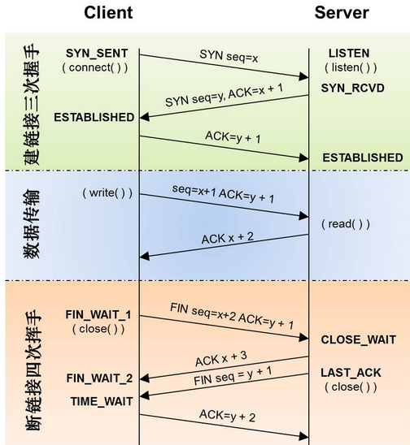
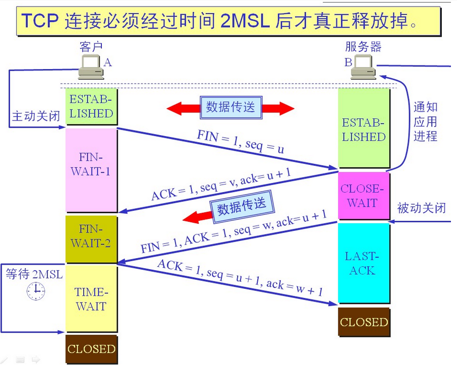

面试相关 TCP三次握手、四次挥手

<!--more-->

## TCP三次握手

握手前主动请求连接的客户端结束了CLOSED阶段，被动连接的服务端结束了CLOSED阶段进入了LISTEN阶段。

第一次握手，客户端发送报文段给服务端，报文段内容为：标志位：**SYN（表示请求建立连接）**序号：seq=x随后客户端进入SYN_SENT阶段

第二次握手，服务端接收到客户端的报文段，结束LISTEN阶段，发送报文段给客户端，报文段内容为：标志位：**SYN，ACK（表示确认客户端的报文段序号有效，并同意建立连接）**序号：seq=y确认号：ack=x+1随后服务端进入SYN_RCVD阶段

第三次握手，客户端接收到服务端的报文段，结束SYN_SENT阶段，发送报文段给服务端，报文段内容为：标志位：**ACK（表示确认服务端的报文段序号有效，能正常收到服务端数据）**序号：seq=x+1序号为：ack=y+1随后客户端进入ESTABLISHED阶段

服务端接收到客户端的报文段后结束SYN_RCVD阶段进入ESTABLISHED阶段，至此三次握手结束

## TCP四次挥手

挥手前主动请求释放连接的客户端和被动释放连接的服务端都处于ESTABLISHED阶段。

第一次挥手，客户端发送报文段给服务端，结束ESTABLISHED阶段，停止发送数据报文段给服务端（已发送未收到ACK确认的仍然会重新发送，ACK确认报文段仍能发送），报文段内容为：标志位：**FIN（表示请求释放连接）**序号：seq=x随后客户端进入FIN_WAIT_1阶段

第二次挥手，服务端接收到客户端的报文段，结束ESTABLISHED阶段，发送报文段给客户端，报文段内容为：标志位：**ACK（表示确认客户端的报文段序号有效，同意释放连接）**序号：seq=y确认号：ack=x+1随后服务端进入CLOSED_WAIT阶段

客户端收到服务端的报文段后结束FIN_WAIT_1阶段进入FIN_WAIT_2阶段

第三次握手，服务端结束CLOSED_WAIT阶段，发送报文段给客户端，停止发送数据报文段给客户端，报文段内容为：标志位：**FIN，ACK（表示确认客户端的报文段序号有效，释放连接已准备完毕）**序号：seq=z确认号：ack=x+1随后服务端进入LAST_ACK阶段

第四次握手，客户端接收到服务端的报文段，结束FIN_WAIT_2阶段，发送报文段给服务端，报文段内容为：标志位：**ACK（表示确认服务端的报文段序号有效，释放连接）**序号：seq=x+1确认号：ack=z+1随后服务端进入TIME_WAIT阶段，2MSL（最大报文存活时间）后结束TIME_WAIT阶段进入CLOSED阶段

服务端接收到客户端的报文段后结束LAST_ACK阶段进入CLOSED阶段，至此四次挥手结束

## 为什么客户端要等待2MSL后结束TIME_WAIT阶段进入CLOSED阶段

保证客户端发送的最后一个ACK报文段能够到达服务端防止“已失效的连接请求报文段”出现在本连接中

## 为什么握手为三次而挥手需要四次

因为当服务端收到客户端的SYN连接请求报文段后，可以直接发送SYN+ACK报文段。其中ACK报文段是用来应答的，SYN报文段是用来同步的。但是关闭连接时，当服务端收到FIN报文段时，因为其他数据报文段可能没有发送完毕，很可能并不会立即关闭SOCKET，所以只能先回复一个ACK报文段，告诉客户端，“你发的FIN报文段我收到了”。只有等到我服务端所有的报文段都发送完了，我才能发送FIN报文段，因此不能一起发送。故需要四次挥手

---

**学习所得，资料、图片部分来源于网络，如有侵权，请联系本人删除。**

**才疏学浅，若有错误或不当之处，可批评指正，还请见谅！**