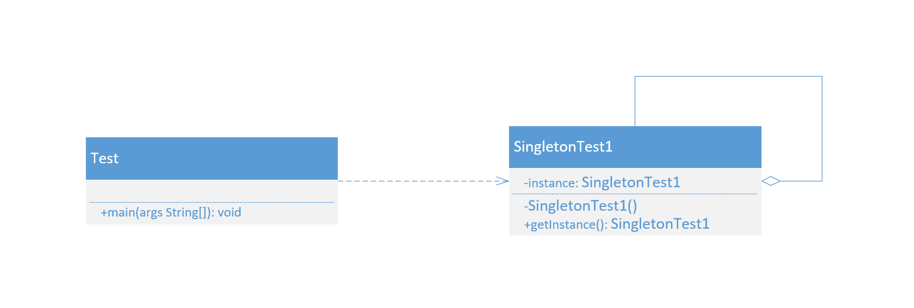

设计模式之单例模式

<!--more-->

---

**定义**：指一个类只有一个实例，且该类能自行创建这个实例的一种模式。

**核心作用**：保证一个类只有一个实例，并且提供一个访问该实例的全局访问点。

**优点**：

> * 单例模式可以保证内存里只有一个实例，减少了内存的开销。
> * 可以避免对资源的多重占用。
> * 单例模式设置全局访问点，可以优化和共享资源的访问。

**缺点**：

> * 单例模式一般没有接口，扩展困难。如果要扩展，则除了修改原来的代码，没有第二种途径，违背开闭原则。
> * 在并发测试中，单例模式不利于代码调试。在调试过程中，如果单例中的代码没有执行完，也不能模拟生成一个新的对象。
> * 单例模式的功能代码通常写在一个类中，如果功能设计不合理，则很容易违背单一职责原则。

**常见的五种单例模式实现方式**：

> * 主要：
>   * **饿汉式**（线程安全，调用效率高。但是，不能延迟加载。）
>   * **懒汉式**（线程安全，调用效率不高。但是，可以延迟加载。）
> * 其他：
>   * **双重检测锁式**（由于JVM底层内部模式原因，偶尔会出问题。不建议使用。）
>   * **静态内部类式**（线程安全，调用效率高。但是，可以延迟加载。）
>   * **枚举单例**（线程安全，调用效率高，不能延迟加载）

**模式的结构与实现**

> * **单例类**：包含一个实例且能自行创建这个实例的类。（如下图“SingletonTest1”）
> * 访问类：使用单例的类。（如下图“Test”）



### 饿汉式

```java
// 饿汉式单例模式(线程安全、调用效率高、不可延迟加载) 
public class SingletonTest1 {
    
    // 类初始化时，立即创建对象（没有延迟加载的优势）。加载类时，天然的是线程安全的。
    private static SingletonTest1 instance = new SingletonTest1();
    
    // 私有化构造器
    private SingletonTest1() {}
    
    // 方法不需要同步，调用效率高。
    public static SingletonTest1 getInstance() {
        return instance;
    }
}
```

### 懒汉式

```java
// 懒汉式单例模式(线程安全、调用效率低、可延迟加载)    
public class SingletonTest2 {

    // 类初始化时，不立即创建对象（延迟加载，真正用的时候再创建）。
    private static SingletonTest2 instance;
    
    // 私有化构造器
    private SingletonTest2() {}
    
    // 方法需要同步，调用效率低。
    public static synchronized SingletonTest2 getInstance() {
        if (instance == null) {
            instance = new SingletonTest2();
        }
        return instance;
    }
}
```

### 双重检测锁式

```java
// 双重检测锁式单例模式（懒汉式的升级版本，但由于指令重排问题，可能会出现问题，不建议使用）
public class SingletonTest3 {

    // 类初始化时，不立即创建对象（延迟加载，真正用的时候再创建）。
    private static SingletonTest3 instance;
    
    // 私有化构造器
    private SingletonTest3() {}
    
    // 方法不一定需要同步，调用相比懒汉式平均效率高。
    public static SingletonTest3 getInstance() {
        //首先判断是否为空
        if (instance == null) {
            //可能多个线程同时进入到这一步进行阻塞等待    
            synchronized (SingletonTest3.class) {
                //第一个线程拿到锁，判断不为空进入下一步
                if (instance == null) {
                    /**
                     * 由于编译器的优化、JVM的优化、操作系统处理器的优化，可能会导致指令重排（happen-before规则下的指令重排，执行结果不变，指令顺序优化排列）
                     * new Singleton3()这条语句大致会有这三个步骤：
                     * 1.在堆中开辟对象所需空间，分配内存地址
                     * 2.根据类加载的初始化顺序进行初始化
                     * 3.将内存地址返回给栈中的引用变量
                     * 
                     * 但是由于指令重排的出现，这三条指令执行顺序会被打乱，可能导致3的顺序和2调换
                     */
                    instance = new SingletonTest3();
                }
            }
        }
        return instance;
    }
    
    /**
     * 　由于指令重排导致3，2的顺序调换以及处于多线程场景，会导致以下问题的出现首先第一个线程执行到了3号指令(instance变量被分配了地址，不为null了)，但对象未初始化。此时！第一个或者第二个if语句进行判断时结果为true，自然而然在使用instance时会出错。
     * 解决的方法便是在instance变量上加上volatile关键字，加上volatile关键字后会禁止该变量的指令重排，从而达到线程安全。
     */
}
```

### 静态内部类式

```java
// 静态内部类式单例模式(线程安全、调用效率高、可延迟加载)    
public class SingletonTest4 {

    private static class SingletonClassInstance {
        // final可加可不加，加载类时，天然的是线程安全的。
        private static final SingletonTest4 INSTANCE = new SingletonTest4();
    }
    
    // 私有化构造器
    private SingletonTest4() {}
    
    // 方法不需要同步，调用效率高。
    public static SingletonTest4 getInstance() {
        return SingletonClassInstance.INSTANCE;
    }
}
```

### 枚举式

```java
// 枚举式单例模式 (线程安全、调用效率高、不可延迟加载)
public enum SingletonTest5 {
    
    /**
     * 可避免反射和反序列漏洞破坏单例特性
     */

    // 这个枚举元素，本身就是单例对象
    INSTANCE;
    
    // 添加自己需要的操作
    public void singletonOperation() {
        
    }
    
    /**
     * 序列化可能会破坏单例模式，比较每次反序列化一个序列化的对象实例时都会创建一个新的实例,枚举类单例可以解决该问题。
     * 枚举序列化是由jvm保证的，每一个枚举类型和定义的枚举变量在JVM中都是唯一的，在枚举类型的序列化和反序列化上，Java做了特殊的规定：在序列化时Java仅仅是将枚举对象的name属性输出到结果中，反序列化的时候则是通过java.lang.Enum的valueOf()方法来根据名字查找枚举对象。同时，编译器是不允许任何对这种序列化机制的定制的并禁用了writeObject、readObject、readObjectNoData、writeReplace和readResolve等方法，从而保证了枚举实例的唯一性.
     */
    public static void main(String[] args) throws Exception {
//        // 测试通过反射创建对象
//        Class clazz = Class.forName("com.crazysky.pattern.singleton.SingletonTest5");
//        // 通过反射调用newInstance方法创建实例时，会判断该类是否为枚举类，是枚举类则会抛出如下异常
//        //java.lang.IllegalArgumentException: Cannot reflectively create enum objects
//        Object obj = clazz.getDeclaredConstructor(String.class,int.class).newInstance("LBJ",23);
//        System.out.println(obj == INSTANCE);
        
        // 测试通过反序列化创建对象
        File file = new File("test.txt");
        ObjectOutputStream oos = new ObjectOutputStream(new BufferedOutputStream(new FileOutputStream(file)));
        oos.writeObject(INSTANCE);
        oos.flush();
        ObjectInputStream ois = new ObjectInputStream(new BufferedInputStream(new FileInputStream(file)));
        System.out.println(ois.readObject() == INSTANCE); // true
    }
    
}
```

### 除枚举式外其他方式如何防止通过反射和反序列化创建对象，破坏单例性

```java
// 以饿汉式单例模式为例
public class SingletonTest6 implements Serializable{

    private static SingletonTest6 instance = new SingletonTest6();
    
    private SingletonTest6() {
        // 防止反射漏洞通过再次调用私有构造方法实例化新的instance
        if (instance != null) {
            throw new RuntimeException("禁止破坏单例性");
        }
    }
    
    public static SingletonTest6 getInstance() {
        return instance;
    }
    
    // 从I/O流读取对象时会调用readResolve接口，在readResolve接口中直接返回instance对象，避免反序列化时重新实例化对象
    // 因为反序列化创建对象的时候，调用的是离反序列化类最近的没有序列化的超类的无参构造函数，所以虽然在当前类中的构造方法中进行了异常抛出，还是可以创建对象
    private Object readResolve() {
        return instance;
        
    }
    
    public static void main(String[] args) throws Exception {
//        // 测试通过反射创建对象
//        Class clazz = Class.forName("com.crazysky.pattern.singleton.SingletonTest6");
//        // java.lang.RuntimeException: 禁止破坏单例性
//        Object obj = clazz.getDeclaredConstructor(null).newInstance(null);
//        System.out.println(obj == getInstance());
        
        // 测试通过反序列化创建对象
        File file = new File("test.txt");
        ObjectOutputStream oos = new ObjectOutputStream(new BufferedOutputStream(new FileOutputStream(file)));
        oos.writeObject(getInstance());
        oos.flush();
        ObjectInputStream ois = new ObjectInputStream(new BufferedInputStream(new FileInputStream(file)));
        System.out.println(ois.readObject() == getInstance()); // true
    }
}
```

### 五种实现单例模式的效率对比

| 实现方式     | 耗时  |
| ------------ | ----- |
| 饿汉式       | 41ms  |
| 懒汉式       | 223ms |
| 双重检测锁式 | 44ms  |
| 静态内部类式 | 40ms  |
| 枚举式       | 35ms  |

```java
// 五种实现单例模式的效率测试
public class SingletonTest7 {

    public static void main(String[] args) throws InterruptedException {
        
        long start = System.currentTimeMillis();
        int threadNum = 10;
        final CountDownLatch countDownLatch = new CountDownLatch(threadNum);
        for (int i = 0; i < threadNum; i++) {
            new Thread(()->{
                for (int j = 0; j < 100000; j++) {
//                    Object obj = SingletonTest1.getInstance(); // 饿汉式 41ms
//                    Object obj = SingletonTest2.getInstance(); // 懒汉式 223ms
//                    Object obj = SingletonTest3.getInstance(); // 双重检测锁式 44ms
//                    Object obj = SingletonTest4.getInstance(); // 静态内部类式 40ms
                    Object obj = SingletonTest5.INSTANCE; // 枚举式 35ms
                }
                countDownLatch.countDown();
            }).start();
        }
        
        countDownLatch.await(); // main 线程阻塞，直到计数器变为0，才会往下执行
        long end = System.currentTimeMillis();
        System.out.println("耗时（ms）：" + (end - start));
    }
}
```

---

**相关链接：**

- [设计模式](/2020/10/01/设计模式/)

**学习所得，资料、图片部分来源于网络，如有侵权，请联系本人删除。**

**才疏学浅，若有错误或不当之处，可批评指正，还请见谅！**