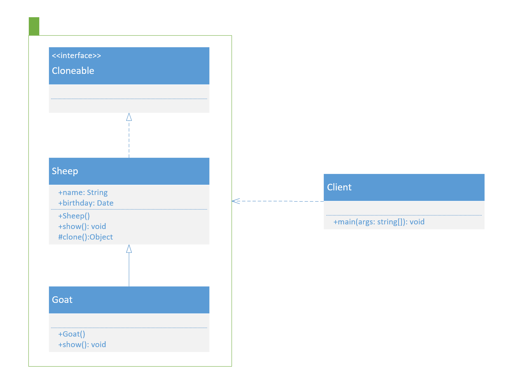

设计模式之原型模式

<!--more-->

---

**定义**：用一个已经创建的实例作为原型，通过复制该原型对象来创建一个和原型相同或相似的新对象。在这里，原型实例指定了要创建的对象的种类。用这种方式创建对象非常高效，根本无须知道对象创建的细节。

**优点**：

> * Java自带的原型模式基于内存二进制流的复制，在性能上比直接 new 一个对象更加优良。
> * 逃避构造函数的约束。

**缺点**：

> * 需要为每一个类都配置一个 clone 方法。
> * 必须实现 Cloneable 接口。
> * clone 方法位于类的内部，当对已有类进行改造的时候，需要修改代码，违背了开闭原则。
> * 当实现深克隆时，需要编写较为复杂的代码，而且当对象之间存在多重嵌套引用时，为了实现深克隆，每一层对象对应的类都必须支持深克隆，实现起来会比较麻烦。因此，深克隆、浅克隆需要运用得当。

**深拷贝与浅拷贝**

> * **浅拷贝**：当类的成员变量是基本数据类型时，浅拷贝会复制该属性的值赋值给新对象。当成员变量是引用数据类型时，浅拷贝复制的是引用数据类型的地址值。这种情况下，当拷贝出的某一个类修改了引用数据类型的成员变量后，会导致所有拷贝出的类都发生改变。
> * **深拷贝**：深拷贝不仅会复制成员变量为基本数据类型的值，给新对象。还会给是引用数据类型的成员变量申请储存空间，并复制引用数据类型成员变量的对象。这样拷贝出的新对象就不怕修改了是引用数据类型的成员变量后，对其它拷贝出的对象造成影响了。

**实现深拷贝的方式**

> * **重写clone方法。**
> * **序列化。**：
>
> **注意**：重写clone方法需要每个引用变量单独调用clone方法，如果引用成员变量多的话，重复性代码多，不便于维护，推荐是使用序列化方式深拷贝。

**模式的结构与实现**

> * **抽象原型类（Prototype）**：规定了具体原型对象必须实现的接口。（如下图“Sheep”）
> * **具体原型类（Concrete Prototype）**：实现抽象原型类的 clone() 方法，它是可被复制的对象。（如下图“Goat”）
> * 调用者（Caller）：使用具体原型类中的 clone() 方法来复制新的对象。（如下图“Client”）



```java
// 羊的抽象类
public abstract class Sheep implements Cloneable {
    
    private String name;
    
    private Date birthday;
    
    public Sheep(String name, Date birthday) {
        this.name = name;
        this.birthday = birthday;
    }

    public abstract void show();
    
    @Override
    protected Object clone() throws CloneNotSupportedException {
        return super.clone();
    }

    public String getName() {
        return name;
    }

    public void setName(String name) {
        this.name = name;
    }

    public Date getBirthday() {
        return birthday;
    }

    public void setBirthday(Date birthday) {
        this.birthday = birthday;
    }
}
```

```java
// 山羊类
public class Goat extends Sheep {

    public Goat(String name, Date birthday) {
        super(name, birthday);
    }
    
    @Override
    public void show() {
        System.out.println("我是一只山羊");
        System.out.println(getName());
        System.out.println(getBirthday());
    }
}
```

```java
// 调用类
public class Client {

    public static void main(String[] args) throws CloneNotSupportedException {
        Date date = new Date(12345678901L);
        Sheep goat1 = new Goat("多莉", date);
        System.out.println(goat1);
        goat1.show();
        
        date.setTime(10987654321L);
        
        Sheep goat2 = (Sheep) goat1.clone();
        System.out.println(goat2);
        goat2.show();
    }
}
```

---

**相关链接：**

- [设计模式](/2020/10/01/设计模式/)

**学习所得，资料、图片部分来源于网络，如有侵权，请联系本人删除。**

**才疏学浅，若有错误或不当之处，可批评指正，还请见谅！**