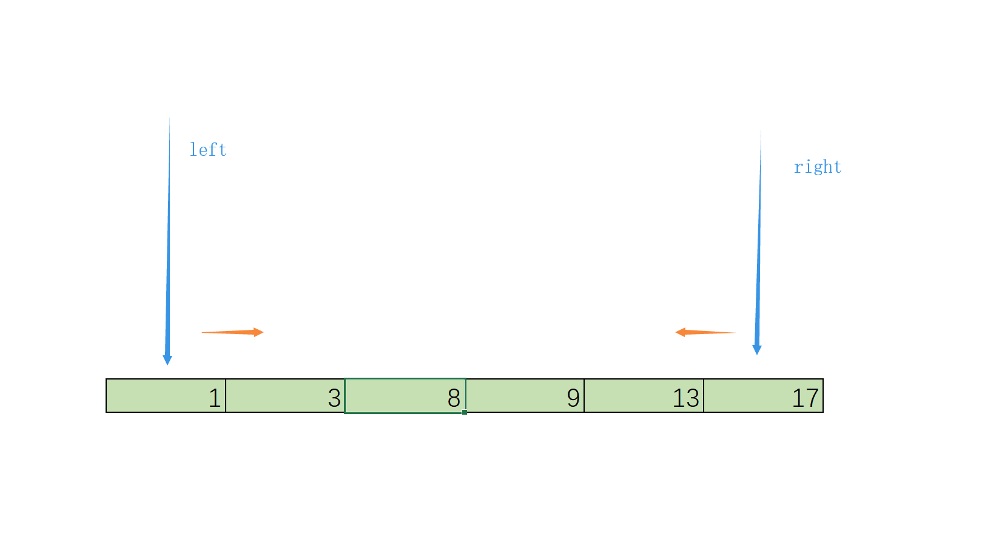
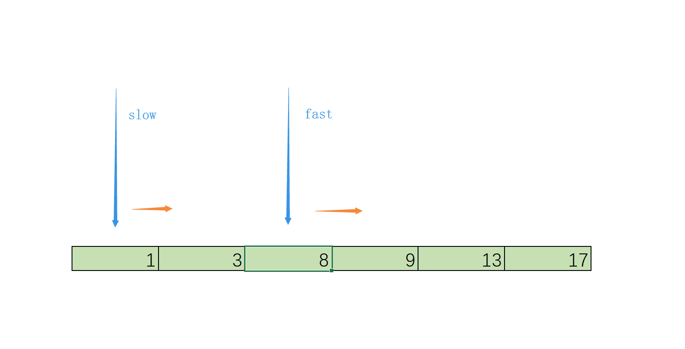

浅谈双指针算法思想

<!--more-->

---

### 算法思想

**双指针**，指的是在遍历对象的过程中，不是普通的使用单个指针进行访问，而是使用两个相同方向（*快慢指针*）或者相反方向（*对撞指针*）的指针进行扫描，从而达到相应的目的。

（**注：**这里的指针并非专指c语言中的指针，表达的含义是下标、索引值或者是可进行迭代的对象等）

### 对撞指针

**对撞指针**是指在有序数组中，将指向最左侧的索引定义为`左指针(left)`，最右侧的定义为`右指针(right)`，然后从两头向中间进行数组遍历。

### 快慢指针

**快慢指针**是从同一侧开始遍历数组，将这两个指针分别定义为`快指针（fast）`和`慢指针（slow）`，两个指针以不同的策略移动，直到两个指针的值相等或满足其他条件为止，如fast每次增长两个，slow每次增长一个。

### 算法总结

**对撞指针：**可以将两重循环O(n^2)的时间复杂度转化为一重循环O(n)的线性复杂度。一般先想一个暴力O(n^2)的做法，然后找i与j之间的单调关系再进行双指针优化。当遇到有序数组时，应该优先想到用双指针来解决问题，因两个指针的同时遍历会减少空间复杂度和时间复杂度。

**快慢指针：**利用快慢指针创造的差值, 可节省内存空间, 减少计算次数, 常用于链表数据结构和判断循环。

---

**学习所得，资料、图片部分来源于网络，如有侵权，请联系本人删除。**

**才疏学浅，若有错误或不当之处，可批评指正，还请见谅！**

