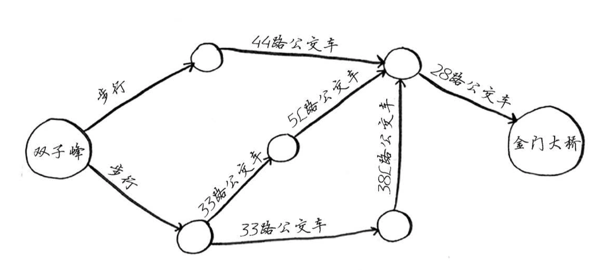

面试相关 图的最短路径问题

<!--more-->

---

**题目：图的最短路径问题**

求解双子峰到金门大桥的最短路径（可认为两点之间的距离都为1）。



**根据题目分析，构建出邻接表：**

```java
// 代表无穷大，当两点之间没有直接可达路径时，两点距离为无穷大
private static final int INF = 0xFFFF;

// 邻接表
private static int[][] map = {
				{0,1,1,INF,INF,INF,INF},
				{INF,0,INF,INF,1,INF,INF},
				{INF,INF,0,1,INF,1,INF},
				{INF,INF,INF,0,1,INF,INF},
				{INF,INF,INF,INF,0,INF,1},
				{INF,INF,INF,INF,1,0,INF},
				{INF,INF,INF,INF,INF,INF,0}
		};
```


## 方法一：动态规划

**思路：**动态规划，状态转移方程为：shortDistance[j] = min(shortDistance[j], shortDistance[i] + map[i][j])，表示到j点的最短距离等于当前到j点的最短距离与到i点的最短距离加上i点到j点的距离的最小值。

**复杂度分析：**

* 时间复杂度：O(n^2)，n为顶点数。
* 空间复杂度：O(n^2)，n为顶点数。

```java
private static int dp(int start, int end) {
    
    int count = map.length;
    int[] shortDistances = new int[count];
    
    for (int i = 0; i < count; i++) {
        shortDistances[i] = map[start][i];
    }

    // 以点i为前置点，从起点到j点的最短距离
    for (int i = 0; i < count; i++) {
        for (int j = 0; j < count; j++) {
            shortDistances[j] = Math.min(shortDistances[j], shortDistances[i] + map[i][j]);
        }
    }

    return shortDistances[end];
}
```

## 方法二：BFS（广度优先搜索）

**思路：**BFS（广度优先搜索），从起点开始扩展直接可达的点，第一次扩展到终点的路径即最短路径，结束搜素。

**复杂度分析：**

* 时间复杂度：O(n)，n为顶点数。
* 空间复杂度：O(n)，n为顶点数。

```java
private static int bfs(int start, int end) {
    
    int shortDistance = 0;
    boolean[] mark = new boolean[map.length];
    Queue<Integer> queue = new LinkedList<>();
    queue.offer(start);
    mark[start] = true;
    int queueLen = 1;

    while (queueLen > 0) {
        int currQueueLen = queueLen;
        shortDistance++;
        while (currQueueLen-- > 0) {
            int currPlace = queue.poll();
            queueLen--;
            for (int i = 0; i < map.length; i++) {
                if (map[currPlace][i] == 1 && !mark[i]) {
                    if (i == end) {
                        return shortDistance;
                    }
                    queue.offer(i);
                    mark[i] = true;
                    queueLen++;
                }
            }
        }

    }
    
    return INF;
}
```

## 方法三：DFS（深度优先搜索）

**思路：**DFS（深度优先搜索），从起点开始递归（递归采用栈来实现）搜素直接可达的点，需要将所有到终点的路径全部搜素出来，取最优值即为最短路径。

**复杂度分析：**

* 时间复杂度：O(n)，n为顶点数。
* 空间复杂度：O(n)，n为顶点数。

```java
private static int dfs(int start, int end) {
    
    int shortDistance = INF;
    boolean[] mark = new boolean[map.length];

    Stack<Integer> stack = new Stack<>();
    stack.push(start);
    mark[start] = true;
    int stackLen = 1;

    while (stackLen > 0) {
        int currPlace = stack.peek();

        boolean is_push = false;
        for (int i = 0; i < map.length; i++) {
            if (map[currPlace][i] == 1 && !mark[i]) {
                if (i == end) {
                    shortDistance = Math.min(shortDistance, stackLen);
                }
                stack.push(i);
                mark[i] = true;
                stackLen++;
                is_push = true;
                break;
            }
        }
        if (!is_push) {
            stack.pop();
            stackLen--;
        }
    }
    
    return shortDistance;
}
```

## 方法四：Dijkstra（迪杰斯特拉算法）

**思路：**Dijkstra（迪杰斯特拉算法，更适合求单源最短路径），每次寻找离起点距离最短的点，得到以该点为中间点到各顶点的距离，然后更新当前从起点到各顶点的最短距离，重复n（n为顶点个数）次。

**复杂度分析：**

* 时间复杂度：O(n^2)，n为顶点数。
* 空间复杂度：O(n)，n为顶点数。

```java
private static int dijkstra(int start, int end) {
    
    // 初始化最短路径数组和标记数组
    int[] shortDistances = new int[map.length];
    boolean[] mark = new boolean[map.length];
    for(int i = 0;i < map.length;i++) {
        shortDistances[i] = map[start][i];
        mark[i] = false;
    }
    mark[start] = true;

    for(int i = 0;i < map.length;i++) {
        int min = INF;
        int k = 0;
        // 找到起点到其它顶点中距离最小的一个顶点
        for(int j = 0;j < map.length;j++) {
            if(!mark[j] && min > shortDistances[j]) {
                min = shortDistances[j];
                k = j;
            }
        }
        mark[k] = true;
        // 将起点到其它顶点的距离与加入中间顶点k之后的距离进行比较，更新最短距离
        for(int j = 0;j < map.length;j++) {
            if(!mark[j]) {
                shortDistances[j] = Math.min(shortDistances[j], min + map[k][j]);
            }
        }
    }
    return shortDistances[end];
}
```

## 方法五：Floyd（佛洛依德算法）

**思路：**Floyd（佛洛依德算法，经化简已类式动态规划，更适合求多源最短路径），遍历顶点，求出以遍历的顶点k为中间点的所有顶点i到顶点j的距离，如果这个距离比顶点i到顶点j的当前最短距离还短，则更新顶点i到顶点j最短距离。

**复杂度分析：**

* 时间复杂度：O(n^3)，n为顶点数。
* 空间复杂度：O(n^2)，n为顶点数。

```java
private static int floyd(int start, int end) {
		
    // 初始化
    int count = map.length;
    int[][] shortDistances = new int[count][count];
    System.arraycopy(map, 0, shortDistances, 0, count);

    // 遍历顶点，求出以遍历的顶点k为中间点的所有顶点i到顶点j的距离，如果这个距离比顶点i到顶点j的当前最短距离还短，则更新顶点i到顶点j最短距离
    for (int k = 0; k < count; k++) {
        for (int i = 0; i < count; i++) {
            for (int j = 0; j < count; j++) {
                shortDistances[i][j] = Math.min(shortDistances[i][j], shortDistances[i][k] + shortDistances[k][j]);
            }
        }
    }
    
    return shortDistances[start][end];
}
```

---

**学习所得，资料、图片部分来源于网络，如有侵权，请联系本人删除。**

**才疏学浅，若有错误或不当之处，可批评指正，还请见谅！**