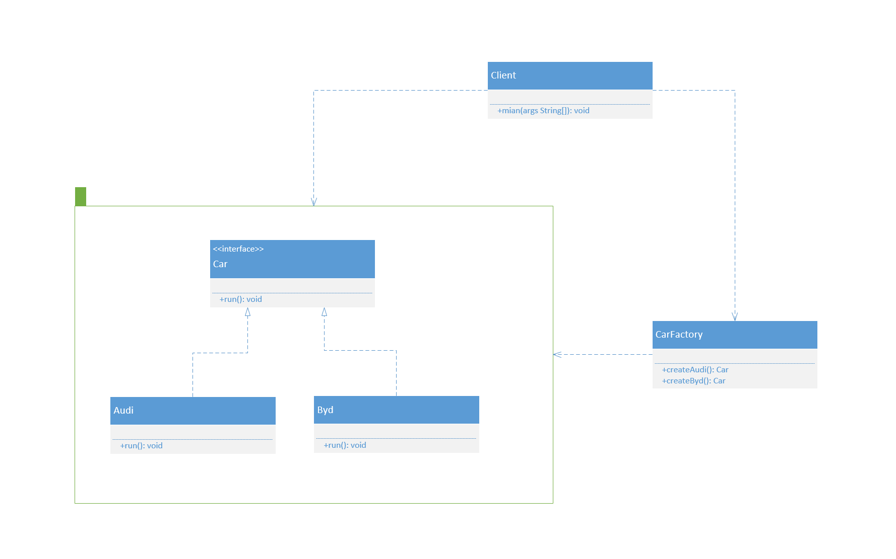
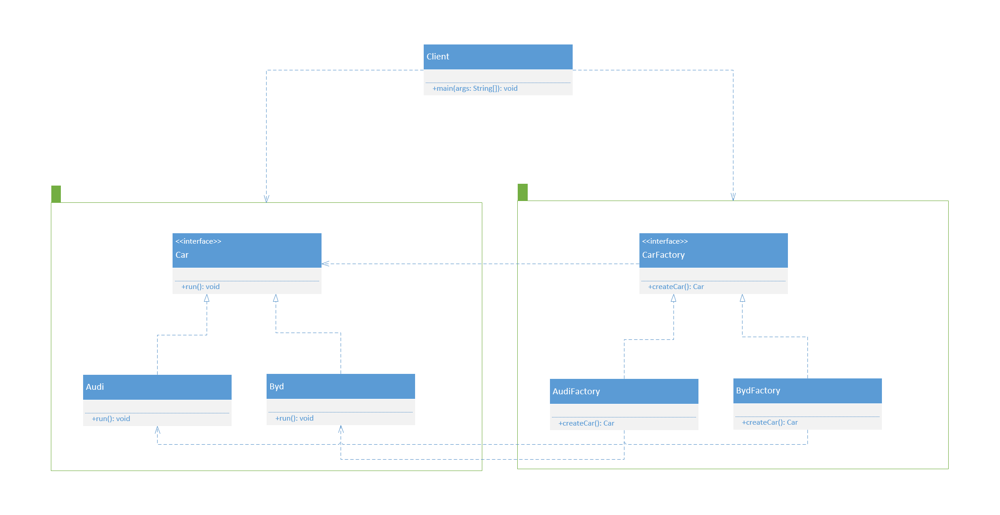
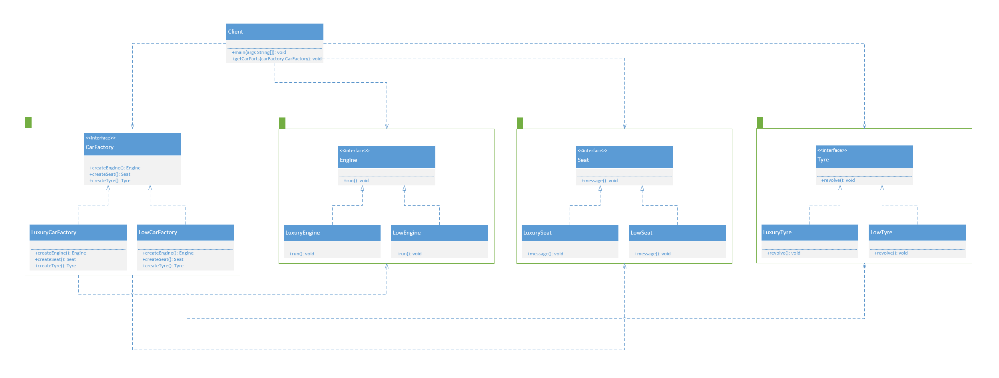

23种设计模式——GOF（Group of four）

设计模式之工厂模式

<!--more-->

---

**定义**：在基类中定义创建对象的一个接口，让子类决定实例化哪个类。工厂方法让一个类的实例化延迟到子类中进行。

**核心作用**：实现创建者和调用者分离。

**核心本质**：

> * 实例化对象，用工厂方法代替new操作。
> * 将选择实现类、创建对象统一管理和控制。从而将调用者跟我们的实现类解耦。

**详细分类**：

> * **简单工厂模式**
>
>   用来生产同一等级结构中的任意产品。（对于增加新的产品，需要修改已有代码）
>
> * **工厂方法模式**
>
>   用来生产同一等级结构中的固定产品。（支持增加任意产品）
>
> * **抽象工厂模式**
>
>   用来生产不同产品族的全部产品。（对于增加新的产品，无能为力，支持增加产品族）

### 简单工厂模式

**定义**：简单工厂模式也叫静态工厂模式，就是工厂类一般使用静态方法，通过接收的参数不同来返回不同的对象实例。

**优点**：

> * 工厂类包含必要的逻辑判断，可以决定在什么时候创建哪一个产品的实例。客户端可以免除直接创建产品对象的职责，很方便的创建出相应的产品。工厂和产品的职责区分明确。
> * 客户端无需知道所创建具体产品的类名，只需知道参数即可。
> * 可以引入配置文件，在不修改客户端代码的情况下更换和添加新的具体产品类。

**缺点**：

> * 简单工厂模式的工厂类单一，负责所有产品的创建，职责过重，一旦异常，整个系统将受影响。且工厂类代码会非常臃肿，违背高聚合原则。
> * 使用简单工厂模式会增加系统中类的个数（引入新的工厂类），增加系统的复杂度和理解难度。
> * 系统扩展困难，一旦增加新产品不得不修改工厂逻辑，在产品类型较多时，可能造成逻辑过于复杂。
> * 简单工厂模式使用了 static 工厂方法，造成工厂角色无法形成基于继承的等级结构。

**模式的结构与实现**

> * **简单工厂（SimpleFactory）**：是简单工厂模式的核心，负责实现创建所有实例的内部逻辑。工厂类的创建产品类的方法可以被外界直接调用，创建所需的产品对象。（如下图“CarFactory”）
> * **抽象产品（Product）**：是简单工厂创建的所有对象的父类，负责描述所有实例共有的公共接口。（如下图“Car”）
> * **具体产品（ConcreteProduct）**：是简单工厂模式的创建目标。（如下图“Audi”、“Byd”）
> * 调用者（Caller）：工厂的调用者。（如下图“Client”）



```java
// 车的接口
public interface Car {

    void run();
}
```

```java
// 奥迪车类
public class Audi implements Car{

    @Override
    public void run() {
        System.out.println("奥迪在跑》》》");
    }
}
```

```java
// 比亚迪车类
public class Byd implements Car{

    @Override
    public void run() {
        System.out.println("比亚迪在跑》》》");
    }
}
```

```java
// 车的工厂类
public class CarFactory {
    
    public static Car createAudi(){
        return new Audi();
    }
    
    public static Car createByd(){
        return new Byd();
    }
}
```

```java
// 客户类
public class Client {

    public static void main(String[] args) {
        Car audi = CarFactory.createAudi();
        Car byd = CarFactory.createByd();
        audi.run(); // 奥迪在跑》》》
        byd.run(); // 比亚迪在跑》》》
    }
}
```

### 工厂方法模式

**定义**：工厂方法模式，又称多态性工厂模式或虚拟构造子模式。通过定义工厂父类负责定义创建对象的公共接口，而子类则负责生成具体的对象。

**与简单工厂模式的区别**：

> * 工厂方法模式避免了简单工厂模式不完全满足OCP的缺点。
> * 工厂方法模式和简单工厂模式最大的不同在于，简单工厂模式只有一个（对于一个项目或者一个独立模块而言）工厂类，而工厂方法模式有一组实现了相同接口的工厂类。

**优点**：

> * 用户只需要知道具体工厂的名称就可得到所要的产品，无须知道产品的具体创建过程。
> * 灵活性增强，对于新产品的创建，只需多写一个相应的工厂类。
> * 典型的解耦框架。高层模块只需要知道产品的抽象类，无须关心其他实现类，满足迪米特法则、依赖倒置原则和里氏替换原则。

**缺点**：

> * 类的个数容易过多，增加复杂度。
> * 增加了系统的抽象性和理解难度。
> * 抽象产品只能生产一种产品，此弊端可使用抽象工厂模式解决。

**模式的结构与实现**：

> * **抽象工厂（Abstract Factory）**：提供了创建产品的接口，调用者通过它访问具体工厂的工厂方法来创建产品。（如下图“CarFactory”）
> * **具体工厂（ConcreteFactory）**：主要是实现抽象工厂中的抽象方法，完成具体产品的创建。（如下图“AudiFactory”、“BydFactory”）
> * **抽象产品（Product）**：定义了产品的规范，描述了产品的主要特性和功能。（如下图“Car”）
> * **具体产品（ConcreteProduct）**：实现了抽象产品角色所定义的接口，由具体工厂来创建，它同具体工厂之间一一对应。（如下图“Audi”、“Byd”）
> * 调用者（Caller）：工厂的调用者。（如下图“Client”）



```java
// 车的接口
public interface Car {

    void run();
}
```

```java
// 奥迪车类
public class Audi implements Car{

    @Override
    public void run() {
        System.out.println("奥迪在跑》》》");
    }
}
```

```java
// 比亚迪车类
public class Byd implements Car{

    @Override
    public void run() {
        System.out.println("比亚迪在跑》》》");
    }
}
```

```java
// 车的工厂接口类
public interface CarFactory {
    
    Car createCar();
}
```

```java
// 奥迪工厂类
public class AudiFactory implements CarFactory{

    @Override
    public Car createCar() {
        return new Audi();
    }
}
```

```java
// 比亚迪工厂类
public class BydFactory implements CarFactory{

    @Override
    public Car createCar() {
        return new Byd();
    }
}
```

```java
// 客户类
public class Client {

    public static void main(String[] args) {
        Car audi = CarFactory.createAudi();
        Car byd = CarFactory.createByd();
        audi.run(); // 奥迪在跑》》》
        byd.run(); // 比亚迪在跑》》》
    }
}
```

### 抽象工厂模式

**定义**：是一种为访问类提供一个创建一组相关或相互依赖对象的接口，且访问类无须指定所要产品的具体类就能得到同族的不同等级的产品的模式结构。

为避免简单工厂模式的缺点，不完全满足OCP。

工厂方法模式和简单工厂模式最大的不同在于，简单工厂模式只有一个（对于一个项目或者一个独立模块而言）工厂类，而工厂方法模式有一组实现了相同接口的工厂类。

**优点**：

> * 可以在类的内部对产品族中相关联的多等级产品共同管理，而不必专门引入多个新的类来进行管理。
> * 当需要产品族时，抽象工厂可以保证客户端始终只使用同一个产品的产品组。
> * 抽象工厂增强了程序的可扩展性，当增加一个新的产品族时，不需要修改原代码，满足开闭原则。

**缺点**：

> * 当产品族中需要增加一个新的产品时，所有的工厂类都需要进行修改。增加了系统的抽象性和理解难度。

**模式的结构与实现**：

> * **抽象工厂（Abstract Factory）**：提供了创建产品的接口，它包含多个创建产品的方法可以创建多个不同等级的产品。（如下图“CarFactory”）
> * **具体工厂（ConcreteFactory）**：主要是实现抽象工厂中的抽象方法，完成具体产品的创建。（如下图“LuxuryCarFactory”、“LowCarFactory”）
> * **抽象产品（Product）**：定义了产品的规范，描述了产品的主要特性和功能，抽象工厂模式有多个抽象产品。（如下图“Engine”、“Seat”、“Tyre”）
> * **具体产品（ConcreteProduct）**：实现了抽象产品角色所定义的接口，由具体工厂来创建，它同具体工厂之间一一对应。（如下图“LuxuryEngine”、“LuxurySeat”、“LuxuryTyre”、“LowEngine”、“LowSeat”、“LowTyre”）
> * 调用者（Caller）：工厂的调用者。（如下图“Client”）



```java
// 发动机接口
public interface Engine {
    
    void run();
}
```

```java
// 高端发动机类 
public class LuxuryEngine implements Engine {

    @Override
    public void run() {
        System.out.println("转的快！");
    }
}
```

```java
// 低端发动机类
public class LowEngine implements Engine {

    @Override
    public void run() {
        System.out.println("转的慢！");
    }
}
```

```java
// 座椅接口
public interface Seat {

    void message();
}
```

```java
// 高端座椅类
public class LuxurySeat implements Seat {

    @Override
    public void message() {
        System.out.println("可以自动按摩！");
    }
}
```

```java
// 低端座椅类
public class LowSeat implements Seat {

    @Override
    public void message() {
        System.out.println("不能按摩！");
    }
}
```

```java
// 轮胎接口 
public interface Tyre {

    void revolve();
}
```

```java
// 高端轮胎类
public class LuxuryTyre implements Tyre {

    @Override
    public void revolve() {
        System.out.println("旋转磨损慢！");
    }
}
```

```java
// 低端轮胎类
public class LowTyre implements Tyre {

    @Override
    public void revolve() {
        System.out.println("旋转磨损快！");
    }
}
```

```java
// 车的工厂接口类
public interface CarFactory {
    
    Engine createEngine();
    
    Seat createSeat();
    
    Tyre createTyre();
}
```

```java
// 高端汽车工厂类 
public class LuxuryCarFactory implements CarFactory {

    @Override
    public Engine createEngine() {
        return new LuxuryEngine();
    }

    @Override
    public Seat createSeat() {
        return new LuxurySeat();
    }

    @Override
    public Tyre createTyre() {
        return new LuxuryTyre();
    }
}
```

```java
// 低端汽车工厂类  
public class LowCarFactory implements CarFactory {

    @Override
    public Engine createEngine() {
        return new LowEngine();
    }

    @Override
    public Seat createSeat() {
        return new LowSeat();
    }

    @Override
    public Tyre createTyre() {
        return new LowTyre();
    }
}
```

```java
// 客户类
public class Client {

    public static void main(String[] args) {
        getCarParts(new LuxuryCarFactory()); //  转的快！ 可以自动按摩！ 旋转磨损慢！
        getCarParts(new LowCarFactory()); //  转的慢！ 不能按摩！ 旋转磨损快！
    }
    
    public static void getCarParts(CarFactory carFactory) {
        Engine engine = carFactory.createEngine();
        Seat seat = carFactory.createSeat();
        Tyre tyre = carFactory.createTyre();
        engine.run();
        seat.message();
        tyre.revolve();
    }
}
```

---

**相关链接：**

- [设计模式](/2020/10/01/设计模式/)

**学习所得，资料、图片部分来源于网络，如有侵权，请联系本人删除。**

**才疏学浅，若有错误或不当之处，可批评指正，还请见谅！**