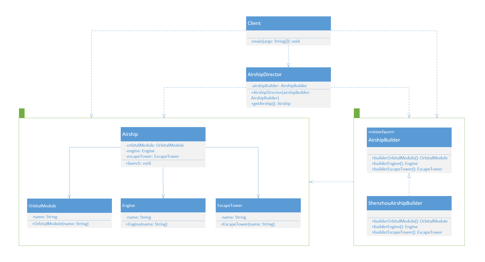

设计模式之建造者模式

<!--more-->

---

**定义**：指将一个复杂对象的构造与它的表示分离，使同样的构建过程可以创建不同的表示，这样的设计模式被称为建造者模式。它是将一个复杂的对象分解为多个简单的对象，然后一步一步构建而成。它将变与不变相分离，即产品的组成部分是不变的，但每一部分是可以灵活选择的。

**优点**：

> * 封装性好，构建和表示分离。
> * 扩展性好，各个具体的建造者相互独立，有利于系统的解耦。
> * 客户端不必知道产品内部组成的细节，建造者可以对创建过程逐步细化，而不对其它模块产生任何影响，便于控制细节风险。

**缺点**：

> * 产品的组成部分必须相同，这限制了其使用范围。
> * 如果产品的内部变化复杂，如果产品内部发生变化，则建造者也要同步修改，后期维护成本较大。

**与工厂模式的区别**

> * 建造者（Builder）模式和工厂模式的关注点不同：建造者模式注重零部件的组装过程，而工厂方法模式更注重零部件的创建过程，但两者可以结合使用。

**模式的结构与实现**

> * **产品角色（Product）**：它是包含多个组成部件的复杂对象，由具体建造者来创建其各个零部件。（如下图“Airship”、“OrbitalModule”、“Engine”、“EscapeTower”）
> * **抽象建造者（Builder）**：它是一个包含创建产品各个子部件的抽象方法的接口，通常还包含一个返回复杂产品的方法 。（如下图“AirshipBuilder”）
> * **具体建造者(Concrete Builder）**：实现抽象建造者中的抽象方法，完成复杂产品的各个部件的具体创建。（如下图“ShenzhouAirshipBuilder”）
> * **指挥者（Director）**：它调用建造者对象中的部件构造与装配方法完成复杂对象的创建，在指挥者中不涉及具体产品的信息。（如下图“AirshipDirector”）
> * 调用者（Caller）：具体产品的使用者。（如下图“Client”）



```java
// 宇宙飞船类
public class Airship {
    
    private OrbitalModule orbitalModule; // 轨道舱
    
    private Engine engine; // 发动机
    
    private EscapeTower escapeTower; // 逃逸塔
    
    public void launch() {
        System.out.println("发射前准备，检查各部件：");
        System.out.println("轨道舱：" + orbitalModule.getName());
        System.out.println("发动机：" + engine.getName());
        System.out.println("逃逸塔：" + escapeTower.getName());
        System.out.println("发射！");
    }

    public OrbitalModule getOrbitalModule() {
        return orbitalModule;
    }

    public void setOrbitalModule(OrbitalModule orbitalModule) {
        this.orbitalModule = orbitalModule;
    }

    public Engine getEngine() {
        return engine;
    }

    public void setEngine(Engine engine) {
        this.engine = engine;
    }

    public EscapeTower getEscapeTower() {
        return escapeTower;
    }

    public void setEscapeTower(EscapeTower escapeTower) {
        this.escapeTower = escapeTower;
    }
}
```

```java
// 轨道舱类
public class OrbitalModule {

    private String name;

    public OrbitalModule(String name) {
        super();
        this.name = name;
    }

    public String getName() {
        return name;
    }

    public void setName(String name) {
        this.name = name;
    }
}
```

```java
// 发动机类 
public class Engine {

    private String name;

    public Engine(String name) {
        super();
        this.name = name;
    }

    public String getName() {
        return name;
    }

    public void setName(String name) {
        this.name = name;
    }
}
```

```java
// 逃逸塔类    
public class EscapeTower {

    private String name;

    public EscapeTower(String name) {
        super();
        this.name = name;
    }

    public String getName() {
        return name;
    }

    public void setName(String name) {
        this.name = name;
    }
}
```

```java
// 宇宙飞船建造接口 
public interface AirshipBuilder {

    OrbitalModule builderOrbitalModule();
    
    Engine builderEngine();
    
    EscapeTower builderEscapeTower();
}
```

```java
// 神舟宇宙飞船建造类 
public class ShenzhouAirshipBuilder implements AirshipBuilder {

    @Override
    public OrbitalModule builderOrbitalModule() {
        return new OrbitalModule("神舟轨道舱");
    }

    @Override
    public Engine builderEngine() {
        return new Engine("神舟发动机");
    }

    @Override
    public EscapeTower builderEscapeTower() {
        return new EscapeTower("神舟逃逸塔");
    }
}
```

```java
// 宇宙飞船装配指挥者类 
public class AirshipDirector {
    
    private AirshipBuilder airshipBuilder;
    
    public AirshipDirector(AirshipBuilder airshipBuilder) {
        this.airshipBuilder = airshipBuilder;
    }

    public Airship getAirship() {
        Airship airship = new Airship();
        airship.setOrbitalModule(airshipBuilder.builderOrbitalModule());
        airship.setEngine(airshipBuilder.builderEngine());
        airship.setEscapeTower(airshipBuilder.builderEscapeTower());
        return airship;
    }
}
```

```java
// 调用者类
public class Client {

    public static void main(String[] args) {
        AirshipDirector airshipDirector = new AirshipDirector(new ShenzhouAirshipBuilder());
        Airship airship = airshipDirector.getAirship();
        airship.launch();
        
        /**
         * 输出结果如下：
         * 
         * 发射前准备，检查各部件：
         * 轨道舱：神舟轨道舱
         * 发动机：神舟发动机
         * 逃逸塔：神舟逃逸塔
         * 发射！
         */
    }
}
```

---

**相关链接：**

- [设计模式](/2020/10/01/设计模式/)

**学习所得，资料、图片部分来源于网络，如有侵权，请联系本人删除。**

**才疏学浅，若有错误或不当之处，可批评指正，还请见谅！**