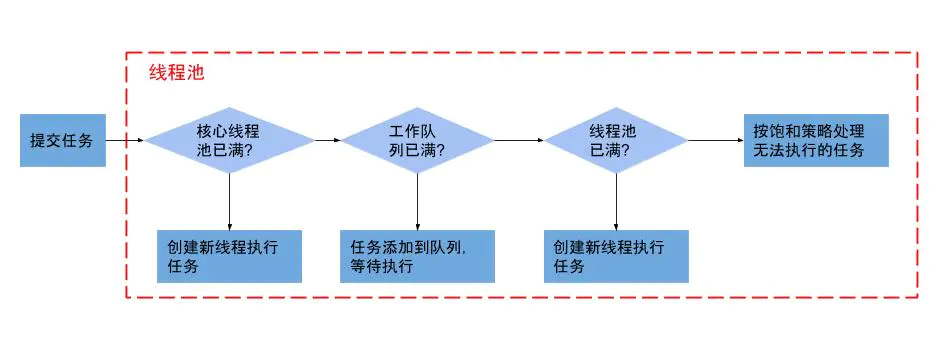

面试相关 线程池浅析

<!--more-->

## 线程池参数

**corePoolSize**：核心线程数

**maximumPoolSize**： 最大线程的数 = 非核心线程数 + 核心线程数

**keepAliveTime**： 线程存活保持时间

**unit**：线程存活保持时间的单位

**workQueue**： 任务队列

**threadFactory**： 创建线程的线程工厂

**handler**： 线程饱和策略

## 线程池工作流程

## 线程饱和策略

|饱和策略|特性|
| -------------------------------------------------------- | ----- |
| **AbortPolicy** | 不执行新任务，直接抛出异常，提示线程池已满（**默认**） |
| **DisCardPolicy**       | 不执行新任务，也不抛出异常 |
| **DisCardOldSetPolicy** | 将消息队列中的第一个任务替换为当前新进来的任务执行 |
| **CallerRunsPolicy** | 直接调用execute来执行当前任务 |

## 四种常见的线程池

|线程池|特性|
| -------------------------------------------------------- | ----- |
| **CachedThreadPool** | 可缓存的线程池，该线程池中没有核心线程，非核心线程的数量为Integer.max_value， 当有需要时创建线程来执行任务，没有需要时回收线程，适用于耗时少，任务量大的情况 |
| **FixedThreadPool** | 定长的线程池，有核心线程，核心线程的即为最大的线程数量，没有非核心线程 |
| **SingleThreadExecutor** | 只有一条线程来执行任务，线程为核心线程，适用于有顺序的任务的应用场景 |
| **ScheduledThreadPool** | 周期性执行任务的线程池，按照某种特定的计划执行线程中的任务，有核心线程，但也有非核心线程，非核心线程的大小也为Integer.max_value。适用于执行周期性的任务 |

---

**学习所得，资料、图片部分来源于网络，如有侵权，请联系本人删除。**

**才疏学浅，若有错误或不当之处，可批评指正，还请见谅！**